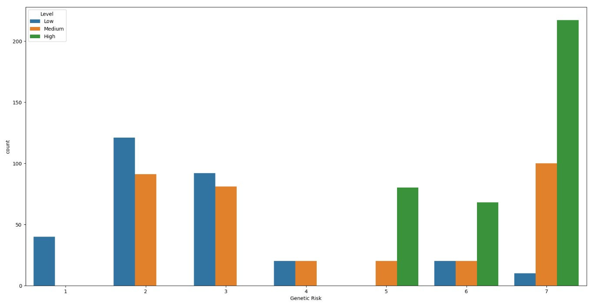
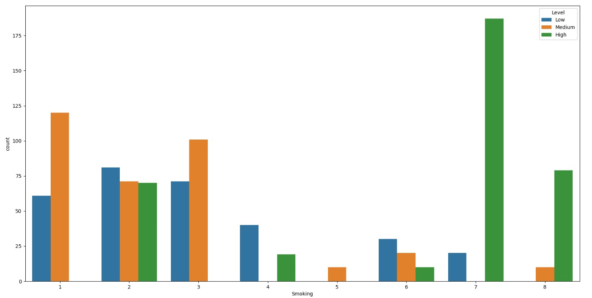
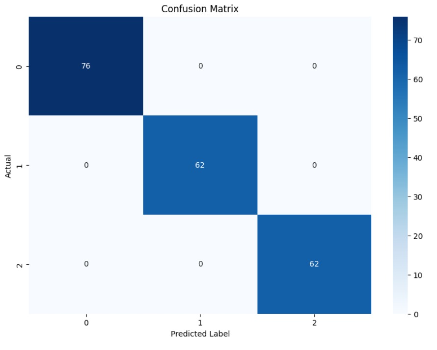
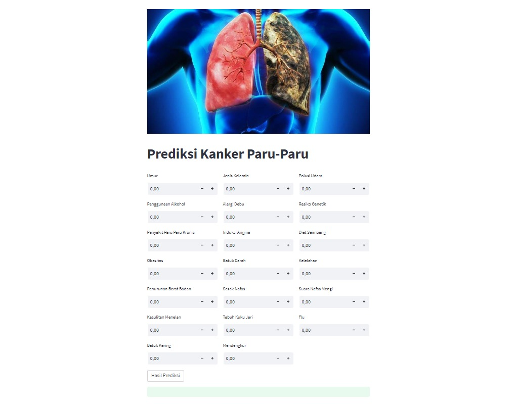

# Laporan Proyek Machine Learning
### Nama : Deni Andriansyah
### Nim : 211351040
### Kelas : Pagi B

## Domain Proyek
Proyek ini ditujukan untuk melakukan analisis kangker paru - paru, penyakit ini telah menjadi fokus utama penelitian dalam dunia kedokteran dan kesehatan karena dampaknya yang sangat merusak bagi individu, keluarga, dan bahkan masyarakat secara keseluruhan. Analisis disini menggunakan data yang mencakup informasi gejala- gejala yang dialami pasien untuk menentukan tingkat keparahan kangker paru - paru pasien, hasil dari proyek ini agar bisa membantu dalam pencegahan atau perawatan pasien kanker paru - paru.

## Business Understanding
Memahami tentang penyakit kanker paru - paru dengan melibatkan gejala - gejala yang dialami yang menjadi penyebab kanker paru - paru itu muncul pada pasien seberapa parah kanker yang dialaminya dan diharapakan bisa menjadi alat yang dapat mengetahui seberapa parah kanker yang dialami pasien.

### Problem Statements
Agar dapat mengetahui seberapa tingkat keparahan pasien kanker paru - paru untuk segera mendapatkan perawatan yang efektif

### Goals
Untuk mengetahui gejala gejala yang dialami pasien serta tingkat keparahan kanker paru - paru pasien agar mambatu langkah perawatan selnajutnya yang efektif untuk pasien kanker paru - paru

### Solution statements
Pengembangan model prediksi untuk membantu memprediksi seberapa parah kanker paru - paru yang dialami pasien menggunakan algoritma K-Nearst Neighbors

## Data Understanding
Dataset yang saya gunakan saya mengambilnya dari Kaggle yang merupakan dasar analisis terkait prediksi kanker paru - paru <br>
[Lung Cancer](https://www.kaggle.com/datasets/thedevastator/cancer-patients-and-air-pollution-a-new-link).

### Variabel-variabel pada Fastfood Nutrition adalah sebagai berikut:
- Patient Id = Identitas Pasien = object
- Age = Usia pasien = int64
- Gender = Jenis kelamin pasien = int64
- Air_Pollution = Tingkat paparan polusi udara pasien = int64
- Alcohol_use = Tingkat penggunaan alkohol pasien = int64
- Dust_Allergy = Tingkat alergi debu pasien = int64
- Genetic_Risk = Tingkat penyakit paru kronis pasien = int64
- chronic_Lung_Disease = Tingkat penyakit paru kronis pasien = int64
- Balanced_Diet = Tingkat diet seimbang pasien = int64
- Obesity = Tingkat obesitas pasien = int64
- Smoking = Tingkat merokok pasien = int64
- Passive_Smoker = Tingkat perokok pasif pasien = int64
- Chest_Pain = Tingkat nyeri dada pasien = int64
- Coughing_of_Blood = Tingkat batuk darah pasien = int64
- Fatigue = Tingkat kelelahan pasien = int64
- Weight_Loss = Tingkat penurunan berat badan pasien = int64
- Shortness_of_Breath = Tingkat sesak nafas pasien = int64
- Wheezing = Tingkat mengi pasien = int64
- Swallowing_Difficulty = Tingkat kesulitan menelan pasien = int64
- Clubbing_of_Finger_Nails = Tingkat clubbing kuku jari pasien = int64
- Frequent_Cold = Sering Pilek = int64
- Dry_Cough = Batuk kering = int64
- Snoring = Keruh = int64
- Level = Level kanker paru - paru = object
  
## Data Preparation
Dataset yang saya gunakan yaitu mengambil dari Kaggle<br>
Pertama import library yang akan digunakan
``` bash
import pandas as pd
import numpy as np
import seaborn as sns
import matplotlib.pyplot as plt
from sklearn.preprocessing import LabelEncoder
encode = LabelEncoder()
from sklearn.model_selection import train_test_split
from sklearn.neighbors import KNeighborsClassifier
from sklearn.metrics import accuracy_score
from sklearn.metrics import confusion_matrix
from sklearn.metrics import classification_report
```
Kemudian selanjutnya agar bisa mendownload dataset dari Kaggle melalui  google colab  dengan Kaggle buat token di Kaggle lalu download
dan unggah token yang sudah di download  pada script di bawah ini
```bash
from google.colab import files
files.upload()
```
Setelah mengupload tokennya, bisa di lanjut dengan membuat sebuah folder untuk menyimpan file kaggle.json yang sudah diupload 
File kaggle.json berisi kunci API Anda yang akan digunakan untuk otentikasi saat menggunakan API Kaggle 
```bash
!mkdir -p ~/.kaggle
!cp kaggle.json ~/.kaggle/
!chmod 600 ~/.kaggle/kaggle.json
!ls ~/.kaggle
```
Selanjutnya mendwonload dataset dari Kaggle
```bash
!kaggle datasets download -d thedevastator/cancer-patients-and-air-pollution-a-new-link
```
Setelah terdownload extract file yang telah terdownload tadi
```bash
!mkdir fastfood-nutrition
!unzip fastfood-nutrition.zip -d fastfood-nutrition
!ls fastfood-nutrition
```
Lanjut dengan membaca file csv yang telah di extract sebelumnya
```bash
df = pd.read_csv('/content/cancer-patients-and-air-pollution-a-new-link/cancer patient data sets.csv')
```
Melihat 5 baris pertama pada datasetnya untuk memeriksa data apakah sudah benar
```bash
df.head()
```
Untuk melihat type data dari masing masing atribut atau fitur dari dataset dengan perintah
```bash
df.info()
```
Untuk melihat data secara acak dari tabel yang mungkin besar, sehingga kita bisa mendapatkan gambaran umum tentang jenis informasi yang terdapat dalam tabel tersebut tanpa harus melihat semua baris datanya.
```bash
df.sample()
```
Selanjutnya disini akan melihat untuk penghitungan jumlah kemunculan setiap nilai yang ada dalam kolom 'Level' dari DataFrame
```bash
df['Level'].value_counts()
```
untuk menghitung jumlah nilai yang hilang di setiap kolom dalam DataFrame
```bash
df.isna().sum()
```
Selanjutnya 
## EDA
Menampilkan sebuah loop yang akan memplot countplot untuk setiap kolom pada dataset data. Countplot akan menampilkan jumlah data pada setiap kategori pada kolom tersebut, dengan kategori dibedakan berdasarkan nilai pada kolom 'level'
```bash
for i in df.columns:
    plt.figure(figsize=(20,10))
    sns.countplot(df,x=i,hue='Level')
    plt.show()
```
 <br>
 <br>
 <br>
 <br>
 <br>
 <br>
 <br>
 <br>
 <br>
 <br>
 <br>
 <br>
 <br>
 <br>
 <br>
 <br>
 <br>
 <br>
 <br>
 <br>
 <br>
 <br>
 <br>
 <br>
 <br>
 <br>

Menampilkan jumlah kemunculan setiap nilai dalam kolom 'Dust Allergy' dari DataFrame df. Ini akan memberikan informasi tentang seberapa sering setiap nilai muncul dalam kolom 'Dust Allergy'.
```bash
print(df['Dust Allergy'].value_counts())
plt.pie(df.Smoking.value_counts(),labels=df.Smoking.value_counts().index,autopct='%.0f%%')
plt.show()
```
 <br>

Menampilkan countplot yang menggambarkan jumlah kemunculan setiap kategori dalam kolom 'Alcohol use'. Kolom 'Alcohol use' berisi informasi tentang tingkat konsumsi alkohol, seperti 'Low', 'Medium', atau 'High'. Grafik ini membagi data berdasarkan kategori 'Alcohol use' 
```bash
sns.countplot(x="Alcohol use", hue="Level", data=df)
plt.show()
```
 <br>

Perintah ini digunakan untuk membuat sebuah jenis grafik bernama "countplot", kita ingin melihat seberapa sering setiap jenis obesitas muncul dalam data tersebut 
```bash
plt.figure(figsize=(18,10))
sns.countplot(x='Obesity',data=df,hue = 'Level', palette='bright'))
```
 <br>

seberapa sering setiap kategori dalam kolom 'Genetic Risk' muncul dalam data 
```bash
sns.countplot(x="Genetic Risk", hue="Level", data=df)
plt.show()
```
 <br>

Selanjutnya melakukan preprocessing 
lalu disini untuk mengubah nilai dalam kolom menjadi bentuk numerik 
```bash
df['Level'] = encode.fit_transform(df['Level'])
```
selanjutnya disini saya menghapus kolom 'index' dan 'Patient Id'
```bash
df = df.drop(columns=['index', 'Patient Id'])
```

## Modeling
Untuk melakukan modeling  memakai algoritma K-Nearst Neighbors dimana harus memisahkan atribut yang akan dijadikan sebagai fitur(x) dan atribut mana yang dijadikan label(y).
```bash
features = ['Age', 'Gender', 'Air Pollution', 'Alcohol use', 'Dust Allergy', 'OccuPational Hazards', 'Genetic Risk', 'chronic Lung Disease', 'Balanced Diet', 'Obesity', 'Coughing of Blood', 'Fatigue', 'Weight Loss', 'Shortness of Breath', 'Wheezing', 'Swallowing Difficulty', 'Clubbing of Finger Nails', 'Frequent Cold', 'Dry Cough', 'Snoring' ]
x = df[features]
y = df['Level']
x.shape, y.shape
```
Setelah itu lakukan split data, memisahkan data training dan data testing 
```bash
x_train, x_test, y_train, y_test = train_test_split(x, y, test_size=0.2, random_state=1)
```
Selanjutnya membuat model yang akan digunakan disini saya menggunakan model K-Nearst Neighbors
```bash
knn = KNeighborsClassifier(n_neighbors=3)
knn.fit(x_train, y_train)
y_pred = knn.predict(x_test)
acc_knn = accuracy_score(y_test, y_pred)
print("Metode K-Nearst Neighboard")
print("Test set accuracy: {:.2f}".format(acc_knn))
print(f"Test set accuracy: {acc_knn}")
```
 <br>

Lalu disini memprediksi tingkat keparahan kanker paru paru berdasarkan data masukan
```bash
input_data = (33, 1, 2, 4, 5, 4, 3, 2, 2, 4, 4, 3, 4, 2, 2, 3, 1, 2, 3, 4)
input_data_numpy = np.asarray(input_data)
data_reshaped = input_data_numpy.reshape(1, -1)
prediksi = knn.predict(data_reshaped)
print(prediksi)

if (prediksi[0] == 0):
    print('Keparahan Kanker Paru-Paru Pasien Berada di Tingkat Tinggi')
elif(prediksi == 2):
    print('Keparahan Kanker Paru-Paru Pasien Berada di Tingkat Sedang')
else:
    print('Keparahan Kanker Paru-Paru Pasien Berada di Tingkat Rendah')
```
Keparahan Kanker Paru-Paru Pasien Berada di Tingkat Rendah

## Visualisasi Hasil Algoritma
Untuk melihat visualisasi hasil algoritma yang dihasilkan
disini saya akan mengukur kinerja model K-Nearest Neighbors (KNN) pada dataset yang sudah dibagi sebelumnya 
```bash
accuracies = []

neighbors = range(1, 21)

for k in neighbors:
    knn = KNeighborsClassifier(n_neighbors=k)
    knn.fit(x_train, y_train)
    y_pred = knn.predict(x_test)
    acc_knn = accuracy_score(y_test, y_pred)
    accuracies.append(acc_knn)

plt.figure(figsize=(8, 6))
plt.plot(neighbors, accuracies, marker='o')
plt.title('KNN: Akurasi terhadap Jumlah Tetangga (n_neighbors)')
plt.xlabel('Jumlah Tetangga (n_neighbors)')
plt.ylabel('Akurasi')
plt.xticks(np.arange(1, 21, step=1))
plt.grid(True)
plt.show()
```
 <br>

Selanjutnya save model sebagai sav agar dapat digunakan pada streamlit
```bash
import pickle

filename = 'kanker-paru-paru.sav'
pickle.dump (knn, open(filename, 'wb'))
```
## Evaluasi
Selanjutnya evaluasi kinerja model 
```bash
print("Confusion Matrix:")
print(confusion_matrix(y_test, y_pred))
print("\nClassification Report:")
print(classification_report(y_test, y_pred))
```
lalu  membuat visualisasi dari confusion matrix
```bash
cm = confusion_matrix(y_test, y_pred)
plt.figure(figsize = (10, 7))
sns.heatmap(cm, annot=True, cmap='Blues', fmt='g')
plt.title('Confusion Matrix')
plt.xlabel('Predicted Label')
plt.ylabel('Actual')
```
 <br>

## Deployment
[Kanker App](https://kankerparuparu-zz2ljvz6d3872djuyxr5at.streamlit.app/).



